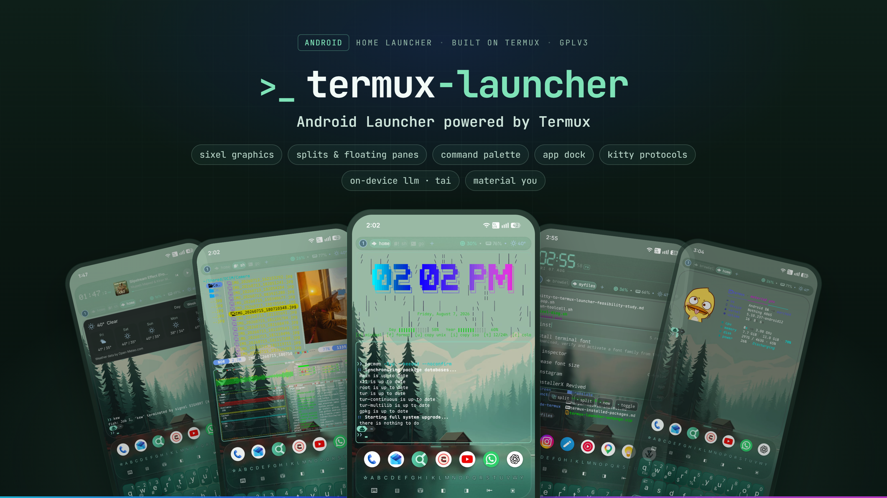
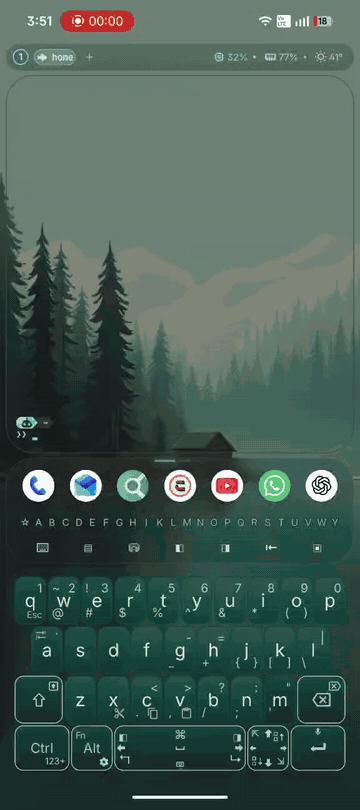

# Termux Launcher

> [!NOTE]
> **This project is entirely vibe-coded.**
> I’ve been daily-driving it as a launcher on a Nothing Phone (2), and it has been stable so far, does not appear to have any noticeable impact on battery life, and uses about ~350 MB of RAM at idle (for reference, something like smart launcher uses about 250 on fresh install).
>
> **Security review wanted**
>
> I’ve made several security-review passes over the codebase using LLMs (FABLE), i would have considered it enough if it continued to be just my launcher, but now that there are others using it, i would really appreciate if an actual developer can have a quick look at the code.
>
> I’m actively looking for someone with Android, Termux, or application-security experience who would be willing to review the project. If you spot anything security-related, please open an issue or discussion.

> [!IMPORTANT]
> **This is an independent fork.** Termux Launcher is not affiliated with, endorsed by, or
> supported by the official [Termux](https://github.com/termux/termux-app) project or its
> maintainers. It is a separately maintained modification that reuses the Termux name only to
> describe what it is built on. Do not report issues with this fork to Termux — file them
> [here](https://github.com/PickleHik3/termux-launcher/issues). The `com.termux` edition shares a
> package name with official Termux and **replaces it** on the device; the other editions install
> side by side. Termux is a trademark of its respective owners.

<p align="center">
  
</p>

**[🌐 Website & docs](https://picklehik3.github.io/termux-launcher-site/)** | [Releases & changelog](https://github.com/PickleHik3/termux-launcher/releases) | [Local AI API](docs/en/LauncherCtl_API.md) | [Termux AI](docs/en/Termux_AI.md)


## About

Termux Launcher is a terminal-first Android home launcher inspired by [TEL](https://github.com/t-e-l/tel), built on [termux-app](https://github.com/termux/termux-app) and [termux-monet](https://github.com/Termux-Monet/termux-monet).
What started out as me just wanting sixel image drawing in [TEL](https://github.com/t-e-l/tel) spiraled out of scope to what this project is today.
All credits go to the amazing developers and contributors of Termux, TEL, and Termux:Monet.

<p align="center">
  
</p>

## Features

- Termux as the actual Android home launcher
- Kitty graphics support (use timg package `timg -pk foo.jpg/gif`)
- Sixel image drawing in terminal
- Native sessions, windows, recursive split and floating panes, layouts, workspace restore, and session browser, **Ctrl + Alt** is the default keybind.
- Kitty keyboard protocol, safe hyperlinks and advanced font shaping
- TUI-tuned touch, unlike stock Termux: drags scroll mouse-aware apps, taps click, and a brief press-and-hold turns the finger into a held mouse button — drag vim selections or resize tmux/TUI panes by touch
- Searchable terminal command palette, tmux-style leader key, modal keymaps, and on-screen key hints
- Scrollback search with vim-style copy mode over the transcript
- App dock, full app drawer (vertical, horizontal, and category layouts) with folders and AI-assisted app categorization
- Android widget pages and an expandable status bar with live CPU, RAM, and weather
- Android Material theme integration for launcher surfaces and Termux shell theming
- Built-in terminal keyboard by default on fresh installs, with Android keyboard and no-keyboard options
- Launch Android apps from the shell with `launcherctl launch`
- `tai` shell command and OpenAI/Ollama-compatible localhost API for on-device LLM inference and model management
- On-device LLM backends using Google's LiteRT and Alibaba's MNN
- Optional Shizuku integration for screen lock and showing CPU usage in status bar

## Editions

> **Three editions are available.** The **`com.termux`** build is the **recommended** version — it stays fully compatible with the upstream Termux package ecosystem. If you want to install it alongside your existing termux install, choose either **`com.termux.launcher.nix`** or **`io.vaj.tl`**.

Every release ships the same launcher built from the same source; the editions differ only in Android package identity and the package ecosystem they use.

| | Termux edition | Nix edition | VAJ demo edition |
|---|---|---|---|
| Package name | `com.termux` | `com.termux.launcher.nix` | `io.vaj.tl` |
| Release tag | `vX.Y.Z` | `vX.Y.Z-nix` | `vX.Y.Z-vaj` |
| Alongside official Termux? | ❌ No — same package name, replaces it | ✅ Yes — installs side by side | ✅ Yes — installs side by side |
| Package manager | `pkg` / APT | [Nix](https://nixos.org) ([guide](docs/en/Nix_Package_Management.md)) | `pkg` / APT |
| Package repository | official Termux repos | official `nixpkgs` binary cache | small VAJ APT repo (`https://repo.pathayam.xyz`) |
| Architectures | arm64-v8a, armeabi-v7a, x86_64, x86 | arm64-v8a, x86_64 — bootstrap downloaded on first run | arm64-v8a (aarch64) only, bootstrap downloaded on first run |
| Companion add-ons | [Termux:API](https://github.com/PickleHik3/termux-api/releases) / [Termux:Styling](https://github.com/PickleHik3/termux-styling/releases) / [Termux:Boot](https://github.com/PickleHik3/termux-boot/releases) (plain tags) | [TLNix:API](https://github.com/PickleHik3/termux-api/releases/tag/nix-v0.53.1) / [TLNix:Styling](https://github.com/PickleHik3/termux-styling/releases/tag/nix-v0.32.2) / [TLNix:Boot](https://github.com/PickleHik3/termux-boot/releases/tag/nix-v0.8.1) (`nix-v*` tags) | same forks, `-vaj` tagged releases |

> ⚠️ **The VAJ edition is to be considered as just a demo.**. It runs off my manually maintained custom APT repo (`https://repo.pathayam.xyz`), which carries only a small fraction of the Termux package set; keeping its crucial packages updated is hard for me, pkg updates may come or may not. Nix edition is suggested if you want to use it along with official termux-app — the **[VAJ to Nix migration guide](docs/en/VAJ_To_Nix_Migration.md)** may help. for the curious among you, this is a [pathayam](https://commons.wikimedia.org/wiki/File:Exhibits_at_Koyikkal_Palace_Museum_Nedumangad_162.jpg), the sketchy URL is because i am just reusing my personal domain for homelab which was never supposed to see the light of day :(. 

Companion add-ons must be the matching builds from this project's forks (they share the launcher's signing key and package family); official F-Droid add-ons will not pair with any edition. Nix-edition companions ship as `nix-v*` tagged releases (TLNix:API, TLNix:Styling, TLNix:Boot).

## Installation

Download the latest APK of your chosen [edition](#editions) from [Releases](https://github.com/PickleHik3/termux-launcher/releases), install it, then select Termux Launcher as your Android home app.

Recommended setup:

- [Shizuku](https://github.com/rikkaapps/shizuku) only if you want optional privileged features
- Matching companion forks when using Termux add-ons (pick the release matching your [edition](#editions): plain tag for `com.termux`, `nix-v*` tag for `com.termux.launcher.nix`, `-vaj` tag for `io.vaj.tl`):
  - [Termux:API](https://github.com/PickleHik3/termux-api/releases)
  - [Termux:Styling](https://github.com/PickleHik3/termux-styling/releases)
  - [Termux:Boot](https://github.com/PickleHik3/termux-boot/releases) — runs the scripts in `~/.termux/boot/` after a restart

The built-in terminal keyboard is enabled on fresh installs; an external keyboard app is optional.
See [Getting Started](docs/en/Launcher_Getting_Started.md) for the setup flow.

### Quick start script

[`setup-launcher`](docs/en/examples/setup-launcher) install my personal shell setup (fish, Oh My Posh with wallpaper Material colors, zoxide, eza, Neovim + AstroNvim, and the binaries — sigye, the animated-logo fastfetch, kitten). Every config it replaces gets a timestamped `.bak` first.

```sh
curl -fsSLO https://raw.githubusercontent.com/PickleHik3/termux-launcher/main/docs/en/examples/setup-launcher
sh setup-launcher
```

Its highly recommended that you use the in-app font picker (**Settings › Terminal › Font**) to install a nerd font since it will configure it properly for seamless font rendering using kitty protocol related features.

## Documentation

**User documentation lives on the [website](https://picklehik3.github.io/termux-launcher-site/)**

In-repo references:

- [Local AI API](docs/en/LauncherCtl_API.md): OpenAI/Ollama-compatible localhost endpoint, app launch, model management, auth, and route tables.
- [Termux AI](docs/en/Termux_AI.md): local model setup, `tai`, OpenAI-compatible clients, and troubleshooting.
- [Building showcase tools](docs/en/Building_Terminal_Showcase_Tools.md): reproducible recipes for Sigye and animated-Kitty Fastfetch, on device and cross-built.
- [VAJ to Nix migration](docs/en/VAJ_To_Nix_Migration.md): moving off the deprecated VAJ edition.
- [Developer Docs](docs/en/Developer_Docs.md): advanced API routes, runtime notes, helper scripts, and security details.

## Upstream Base

- [termux-app](https://github.com/termux/termux-app)
- [termux-monet](https://github.com/Termux-Monet/termux-monet)
- [TEL](https://github.com/t-e-l/tel)

## License and Attributions

Termux Launcher is a modified Termux/Termux:Monet distribution, developed from 2026 onward and
released under GPLv3-only. It is an independent fork with no affiliation to the official Termux
project. See [LICENSE](LICENSE), [license exceptions](LICENSE-EXCEPTIONS.md), and
[open-source notices](THIRD_PARTY_NOTICES.md). The Android app exposes the same notices under
**Settings > Open-source licenses**.

Bundled assets carry their own licenses: the weather animations are
[Meteocons](https://github.com/basmilius/meteocons) (MIT, Copyright 2020-present Bas Milius), and
the icon font is [Symbols Nerd Font Mono](https://github.com/ryanoasis/nerd-fonts) (SIL OFL 1.1).
